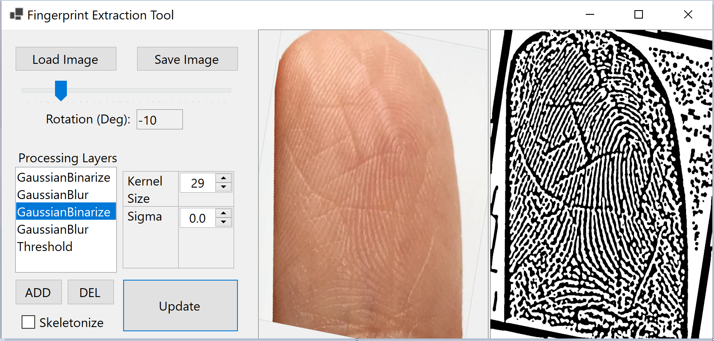

# Fingerprint Processing App

This project is a fingerprint processing application built in C# using WindowsForms and OpenCv. It allows users to load images of fingerprints and design custom processing pipelines for them. Many fingerprint processing systems use a fixed algorithm that doesn't generalize well to all use-cases. For example, touchless fingerprint images are affected by the amount of light reflecting off them, while ink-based or latent fingerprints are based on pressure. Their ridge colors are also inverted, with lighter ridges in images and darker ridges in ink. This app is designed for flexible analysis, allowing you to create a custom ridge extraction process and tune parameters to your specific usage. 

## Features

### Main Features
- **Load/Save Image**: Users can load an image from their device to process, and save the final processed image once finished.
- **Rotate**: A slider allows users to rotate the image to any orientation.
- **Processing Layers**: A list of processing layers where users can:
  - Add layers using the **Add** button.
  - Remove layers using the **Del** button.
  - Adjust parameters for each selected layer (e.g., kernel size, sigma, threshold value, etc.).
- **Skeletonize**: A checkbox that enables or disables skeletonization of the image. This thins the ridge to a single pixel for minutiae extraction.
- **Update Button**: Processes the original image through all custom layers and displays the result.

### Image Display
- The **Original Image** is displayed on the left side.
- The **Processed Image** is displayed on the right side after applying the selected layers.

### Layer Operations
- **Add Layer**: Clicking the **Add** button opens a new form where users can choose a layer type from a dropdown menu. Available layer types:
  - GaussianBlur: Performs a gaussian blur with custom parameters KernelSize and Sigma.
  - GaussianBinarize: Performs a gaussian blur, then an element-wise comparison of original_image >= blurred_image.
  - Threshold: Performs a binary threshold of the image against a single value (i.e., original_img >= 127).
  - Invert: Inverts the images color, useful for switching between contact-based and contactless fingerprints. 
  
- **Remove Layer**: The **Del** button removes the currently selected layer.

## Installation:

1. Clone or download the repository.
2. Install the dependencies:
   - OpenCvSharp
   - OpenCvSharp.Extensions
   - WindowsForms

## Future TODO:
- Add more processing layers: Gabor, Dilate, Erode.
- Add auto-segment and auto-orient
- Add 3D rotation instead of just 2D
- Add minutiae checkbox and matching capabilities

## License
This project is licensed under the [MIT License](LICENSE.txt).
